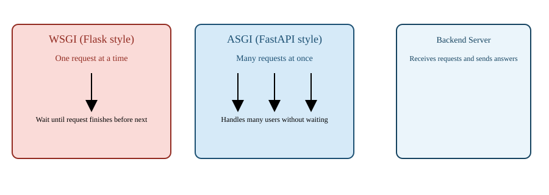
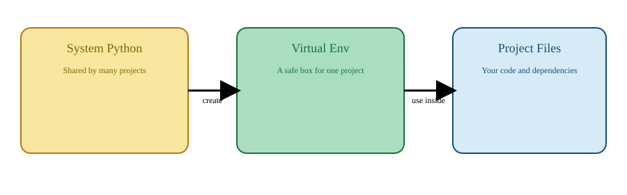
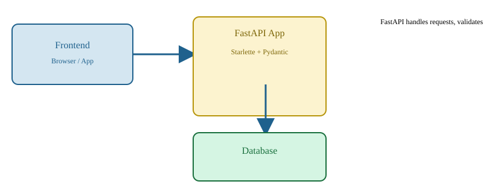

# FastAPI: A Simple, Detailed Guide

## 1) What is FastAPI?

FastAPI is a tool that helps people build web programs called APIs. An API is like a waiter in a restaurant. The waiter takes your order, tells the kitchen what you want, and brings the food back to you. In the same way, FastAPI helps your app take requests from users, do work, and send back results.

- FastAPI is written in Python.
- It is used to build fast and easy web APIs.
- It is great for building services that need to answer quickly.

### Why FastAPI is easy to understand

FastAPI is like building with LEGO blocks:

- you write small pieces (endpoints)
- the pieces fit together nicely
- it even builds the instruction book for you automatically

---

## 2) What is FastAPI built on?

FastAPI works on top of two main parts:

1. **Starlette**
2. **Pydantic**

These are like the engine and the safety checks inside FastAPI.

### 2.1 Starlette

Starlette is the part that helps FastAPI talk to the internet.

Think of Starlette as:

- a traffic controller for web requests
- a dispatcher that sends each request to the right place
- a helper that keeps many users from waiting too long

Starlette does:

- routing (finding the right code for each request)
- handling connections
- working with web servers
- managing background tasks

### 2.2 Pydantic

Pydantic is the part that checks the data.

Pydantic is like a teacher who checks your homework:

- did you give the right type of answer?
- is the input complete?
- does the data look correct?

For example, if your API expects a number, Pydantic makes sure the user does not send a word.

Pydantic also:

- converts data into the right Python types
- returns clear errors when things are wrong
- makes your code safer and easier to read

---

## 3) Philosophy of FastAPI

FastAPI is built with two big ideas:

- make APIs run fast
- make APIs easy to code

It does both by using the right tools and by being smart about how it works.

### Why FastAPI is fast to run

FastAPI is fast because it uses **asynchronous programming** and the fast Starlette engine.

Imagine you are at a school project table and you are building toy robots. If you had to wait for one robot to finish before you start another, it would take longer. FastAPI can start working on many robots at the same time, so it finishes sooner.

### FastAPI and a machine learning model example

Suppose you have a machine learning model that predicts whether a picture is a cat or a dog.

When a request comes in:

1. FastAPI receives the request
2. FastAPI checks the data with Pydantic
3. FastAPI passes the picture to the ML model
4. The model returns a prediction
5. FastAPI sends the result back

Because FastAPI can handle many requests at once, it can serve many pictures quickly.

You can think of the ML model like a toy that guesses if a picture is a cat or a dog. FastAPI is the helper that gives the toy the picture and brings the answer back.

---

## 4) Web server -> ASGI -> API code

A web server is like a door to your application.

When a user sends a request, the request goes through this path:

1. web server
2. ASGI (a special interface)
3. FastAPI code

The web server is the entrance. ASGI is the bridge. The FastAPI code is the building inside.

### WSGI vs ASGI (Flask vs FastAPI)

There are two common ways to connect Python code to the web:

- **WSGI**: used by Flask
- **ASGI**: used by FastAPI

#### WSGI

WSGI is like a single queue at a shop. Each customer is served one by one.

- easy to use
- good for simple apps
- slower when many people come together

#### ASGI

ASGI is like multiple counters at a shop. Many customers can be served at the same time.

- faster for many users
- supports modern features like WebSockets
- good for apps that do many things at once



> FastAPI with ASGI can handle more people without making them wait too much.

---

## 5) Why FastAPI is fast to code

FastAPI saves time for developers. It does a lot of work automatically.

### a) Automatic input validation

When users send data, FastAPI checks it automatically.

If your API expects a number, FastAPI will say:

- "This is not a number"
- "This field is required"

This is like having a robot teacher check your answers before you submit them.

### b) Auto-generated interactive documentation

FastAPI creates a web page that shows all your API endpoints.

This page is like a menu at a restaurant:

- you can see what the API can do
- you can try requests directly from the browser
- you can see what information to send

Two useful docs pages are:

- `/docs` (Swagger)
- `/redoc`

This means you do not have to write the documentation by hand.

### c) Seamless integration with the modern ecosystem

FastAPI works well with many modern tools:

- SQL databases
- async libraries
- machine learning models
- authentication systems

It makes it easy to connect to other tools and build real applications.

---

## 6) Virtual environment and how to create it

A virtual environment is a safe place for your Python project.

Imagine you have a toy box. You keep the toys for one game separate from the toys for another game. That way the toys do not get mixed up.

A virtual environment keeps your project’s Python packages separate from other projects.

### Why use a virtual environment?

- avoid package conflicts
- keep project dependencies organized
- make it easy to share the project with others

### How to create a virtual environment

In the folder where your project lives, run:

```bash
python -m venv venv
```

This makes a new folder called `venv`.

To use it on Windows:

```bash
venv\Scripts\activate
```

On Mac or Linux:

```bash
source venv/bin/activate
```

After activating, install packages only in this environment:

```bash
pip install fastapi uvicorn pydantic
```

### How to know it is active

When the virtual environment is active, your command prompt shows `(venv)` in front.

### How to stop using it

Use:

```bash
deactivate
```



---

## 7) FastAPI explained with a diagram

This diagram shows how FastAPI works with the frontend and the database.



1. A user or a program sends a request.
2. FastAPI receives the request.
3. FastAPI uses Pydantic to validate the data.
4. FastAPI uses Starlette to handle the request and send the response.
5. FastAPI can talk to a database when needed.

---

## 8) Summary: Why FastAPI is a great choice

FastAPI is a great choice because:

- it is fast to run
- it is easy to write
- it checks your data for you
- it creates documentation automatically
- it works well with modern tools
- it uses Starlette and Pydantic under the hood

FastAPI is like a smart helper for building APIs. It lets you focus on the main work, while it handles many details for you.
